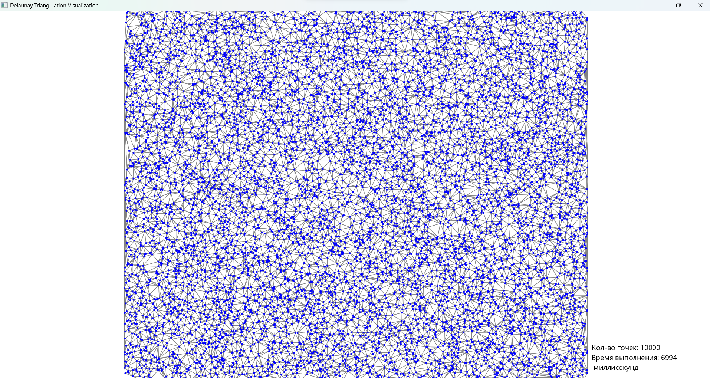

#  Триангуляция Делоне.

## Описание работы
Используется реализация алгоритма триангуляции Делоне на основе инкрементного подхода (Incremental Delaunay Triangulation). Этот алгоритм используется для разбиения множества точек на непересекающиеся треугольники таким образом, чтобы внутри окружностей, описанных вокруг каждого треугольника, не было других точек.
Общая асимптотическая сложность алгоритма инкрементной триангуляции Делоне составляет O(n log n) в среднем и O(n^2) в худшем случае где n - это количество точек.

## Реализация
Алгоритм я реализовал здесь
[src/delauney/Triangulator.java](https://github.com/Rame7407/DelaunayTriangulation/blob/master/src/delauney/Triangulator.java)
Описание работы кода:
* Проверка количества точек и инициализация структур данных:
  * Проверяется, что входной массив точек содержит как минимум 3 точки.
  * Создаются массивы и структуры данных, которые будут использоваться в ходе       алгоритма, такие как points, coords, triangles, halfedges, hullPrev, hullNext, и другие.
* Нахождение начального треугольника:
  * Находится начальная точка (i0), которая ближе всего к центру множества точек.
  * Находится вторая точка (i1), которая ближе всего к первой точке.
  * Находится третья точка (i2), образующая наименьший описывающий окружности вместе с первыми двумя точками.
* Проверка существования начального треугольника:
  * Проверяется, существует ли такой треугольник. Если не существует, выбрасывается исключение, так как алгоритм требует наличия начального треугольника.
* Ориентация начального треугольника:
  * Проверяется ориентация начального треугольника. Если он ориентирован по часовой стрелке, то меняются местами вторая и третья точки.
* Нахождение центра начального треугольника:
  * Находится центр описывающей окружности начального треугольника.
* Сортировка оставшихся точек:
  * Оставшиеся точки сортируются по расстоянию от центра описывающей окружности начального треугольника.
* Установка начальной выпуклой оболочки:
  * Устанавливается начальная выпуклая оболочка, состоящая из начального треугольника.
* Добавление оставшихся точек:
  * Для каждой оставшейся точки выполняется следующее:
    * Находится видимое ребро на текущей выпуклой оболочке.
    * Добавляется новый треугольник с этой точкой и смежными ребрами. При этом может выполняться рекурсивное переворачивание треугольников для соблюдения условия Делоне.
    * Обновляются структуры данных, представляющие выпуклую оболочку и хэш-таблицу ребер.
* Формирование массива выпуклой оболочки:
  * После обработки всех точек формируется массив hull, содержащий индексы точек выпуклой оболочки.
* Очистка лишних данных:
  * Лишние структуры данных удаляются, и массивы triangles и halfedges обрезаются до фактической длины, чтобы они содержали только треугольники, созданные во время триангуляции.

## Визуализация триангуляции
Код создает графическое представление триангуляции Делоне для случайного набора точек и отображает эту информацию на экране, включая отображение треугольников и самих точек, а также информации о времени выполнения.
Визуализация здесь:
[src/delauney/DelaunayVisualization.java](https://github.com/Rame7407/DelaunayTriangulation/blob/master/src/delauney/DelaunayVisualization.java)

Описание работы кода:
* Инициализация и ввод данных:
  * Создается JavaFX-приложение.
  * Запрашивается у пользователя количество точек для триангуляции.
  * Генерируется указанное количество случайных точек на двумерной плоскости (ширина и высота определены как WIDTH и HEIGHT).
* Выполнение триангуляции:
  * Создается экземпляр класса Triangulator для выполнения триангуляции Делоне на сгенерированных точках.
* Инициализация графического интерфейса:
  * Создается графическое окно JavaFX с заданными размерами (ширина и высота).
  * Инициализируется элемент Canvas для рисования на нем.
  * Создается текстовый элемент для вывода информации о количестве точек и времени выполнения.
* Рисование треугольников:
  * Для каждого треугольника, полученного в результате триангуляции, рисуются его стороны с использованием графического контекста GraphicsContext.
* Рисование точек:
  * Точки, представленные входными данными и использованные для триангуляции, отображаются как круги на холсте.
  * Если количество точек невелико (меньше или равно 20 000), то точки рисуются крупными кругами для лучшей видимости.
  * В противном случае (больше 20 000 точек), точки рисуются маленькими кругами.
* Отображение информации о времени выполнения:
  * Выводится информация о количестве точек и времени выполнения программы в текстовом элементе на экране.
* Запуск JavaFX-приложения:
  * Метод launch(args) запускает JavaFX-приложение.

## Примеры работы
Триангуляция 10 точек 
Время работы:1,63с

Триангуляция 10 тысяч точек
Время работы:6,99с

Триангуляция 1млн точек
Время работы:10,06с

